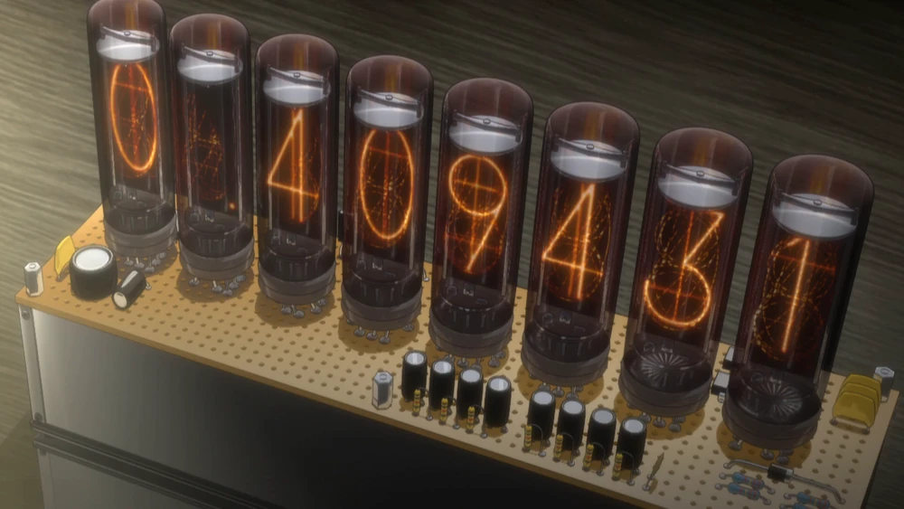

# Lixie

Divergence Meter from Steins;Gate 

## Anime / Visual Novel

In the Visual Novel, when there is a change in the timeline, we can see the number circulating.

## Functionality 

This Divergence meter will act both as a divergence meter (RNG) and also a clock 

## Testing

Before assembly, the module and the firmware was checked to ensure that it is working the way it should.

## Assembled
Assembling the Lixie tubes reuqires the LEDS to be holding the holder fo the acrylic slits.

The Assembled version can be seen below.

Here it acts like a clock with RTC and it will update the time with time server pool.ntp.org

This shows that the it can change into a divergence meter and back into a clock. The number of cycle each tube goes through is random so is the number generated. Only thins which is fixed is the steins;gate worldline (1.048596).

This shows the colour it can change into. Which uses simple HTML colour selection.

